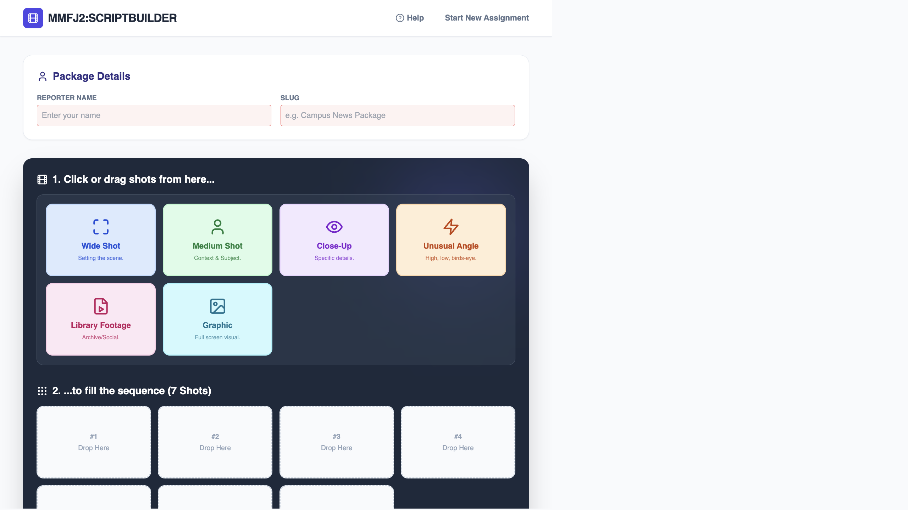
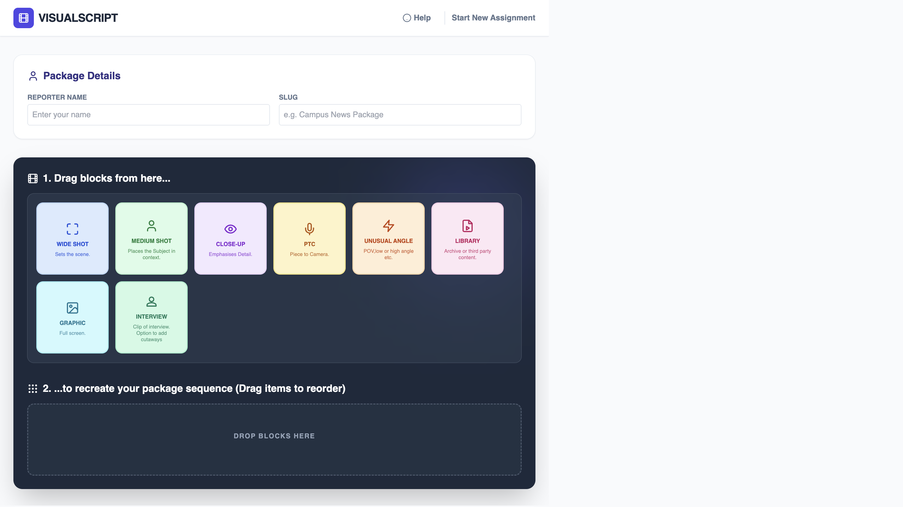
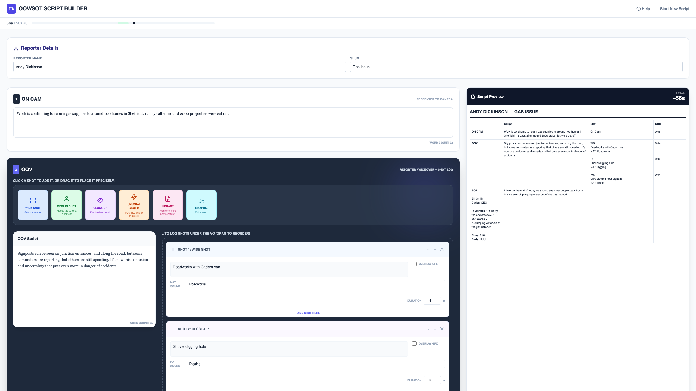
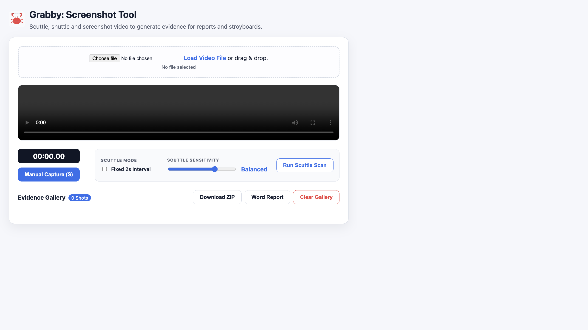
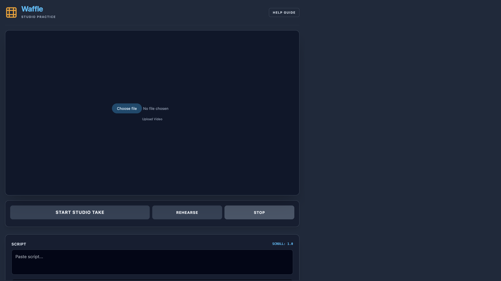
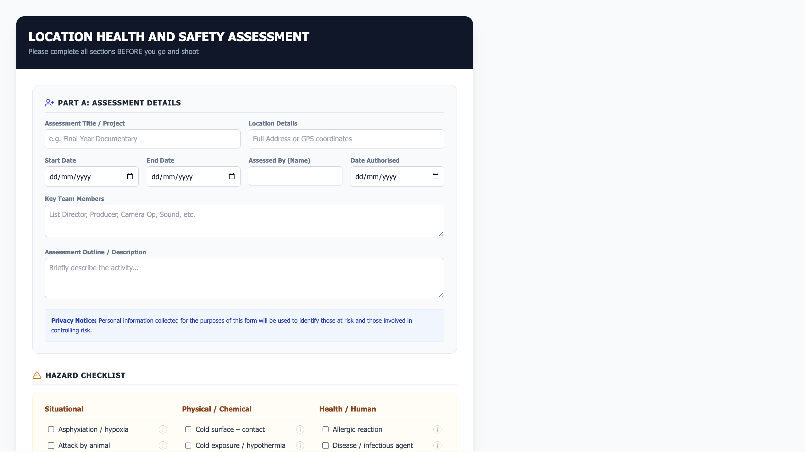

# VJ Teaching Utilities

A collection of lightweight, standalone HTML tools created for video journalism teaching. These utilities are designed to work in a browser and can be added to a VLE such as Moodle, with minimal local setup.

## Overview

- Standalone HTML pages with no local JavaScript or graphics dependencies.
- Require internet access for CDN-hosted libraries and online scripts.
- Useful for script-building, visual storyboarding, shot logging, and practice delivery.

> Note: Some code was generated with assistance from AI and then adapted for teaching use.

## Live demos

Live pages are available via GitHub Pages:

- ScriptBuilder: https://digitaldickinson.github.io/VJUtilities/ScriptBuilder.html
- Visualscript: https://digitaldickinson.github.io/VJUtilities/visualscript.html
- OOV/SOT Script Builder: https://digitaldickinson.github.io/VJUtilities/oov-sots-builder.html
- Grabby: https://digitaldickinson.github.io/VJUtilities/grabby.html
- Waffle: https://digitaldickinson.github.io/VJUtilities/waffle.html
- Risk Assessment: https://digitaldickinson.github.io/VJUtilities/Risk_Assessment.html

## Table of Contents

- [Tools](#tools)
  - [ScriptBuilder](#scriptbuilderhtml)
  - [Visualscript](#visualscripthtml)
  - [OOV/SOT Script Builder](#oovsot-script-builder-oov-sots-builderhtml)
  - [Grabby](#grabbyhtml)
  - [Waffle](#wafflehtml)
  - [Risk Assessment](#risk-assessmenthtml)
- [Usage](#usage)
- [Development](#development)
- [Feedback](#feedback)

## Tools

### ScriptBuilder (`ScriptBuilder.html`)

A standalone script-building page for first-year journalism students.

- Build a formatted script from drag-and-drop shot blocks.
- Designed for a simple package template with shot descriptions, nat sound, and lower-third details.
- Includes basic interview cutaway support.
- Live script preview updates as students add or edit blocks.
- Copy the script to the clipboard.
- Export a Word document formatted for assessment submission.

### Visualscript (`Visualscript.html`)

A more advanced visual script builder with unlimited shots and enhanced scripting tags.

- Standalone HTML page with no local library dependencies.
- Includes standard shot blocks plus an interview block with multiple cutaways.
- Supports overlay graphics and FULL NAT blocks for natural sound only.
- Script tags add advanced behaviour:
  - `[NATPOP=X:TEXT]` for temporary NAT sound lifts, where `X` is duration in seconds.
  - `[SOT=X:TEXT]` for dialogue-focused soundbites.
  - `[GFX:TEXT]` for timed overlay graphic text.

Live demo: https://journalism.cards/visualscript/

### OOV/SOT Script Builder (`oov-sots-builder.html`)

A builder for the OOV/SOTS format: presenter reads to camera, hands off to a reporter
voiceover with shots logged against it, cuts to one clean soundbite, and stops.

- Fixed ON CAM &rarr; OOV &rarr; SOT &rarr; Out structure, with drag-and-drop or click-to-add shot logging under the OOV.
- Mid-interview cutaway support, marked by selecting a span of the SOT transcript.
- Live 50s &plusmn;3 running-time readout, built from actual shot durations and SOT length rather than a word-count guess alone.
- Validation covers contributor details, shot descriptions/durations, in/out words, and cutaway details before export is enabled.
- Autosaves a draft to the browser so an accidental refresh doesn't lose the work.
- Exports a real `.docx` file formatted as a newsroom-style cue sheet.

### Grabby (`grabby.html`)

A lightweight shot logger and screengrab utility.

- Auto-detect scene changes in a video clip.
- Capture individual frames or download multiple shots as a ZIP.
- Export a Word document containing captured images for reports or reflections.

### Waffle (`waffle.html`)

A practice tool for writing, speaking, and timing scripts.

- Run entirely in the browser.
- Generate an audio file from script text.
- Requires microphone permission for live recording.

### Risk Assessment (`Risk_Assessment.html`)

A location health and safety assessment builder for practical media shoots.

- Complete safety checks, location details, and risk assessments in one page.
- Export a Word document for reporting and evidence.
- Built as a standalone HTML page with no local dependencies.

## Usage

1. Open the desired HTML file in a modern browser.
2. Allow internet access for CDN-hosted scripts and libraries.
3. Use the tool directly; no installation is required.

### Running locally

- Open any HTML file directly in the browser for a quick preview.
- If you need local file access or want to avoid browser restrictions, serve the folder with a simple local server:
  - Python 3: `python3 -m http.server 8000`
  - Then open `http://localhost:8000/` in your browser.
- This is useful for testing file downloads, webcam access, and browser security behaviour.

## Development

If you want to develop or extend these tools:

- Edit the HTML files directly.
- Ensure any external dependencies are still accessible when used in a VLE.
- Keep the user interface simple for student use.

## Feedback

Please share any feedback or ideas by email:

- a.dickinson@mmu.ac.uk

Contributions and suggestions are welcome.

